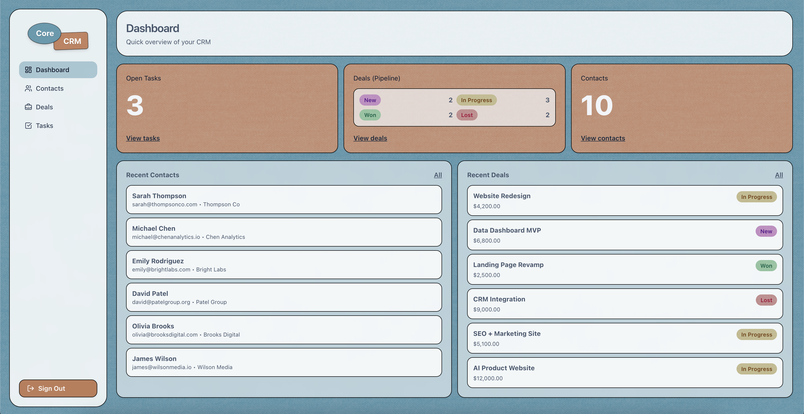
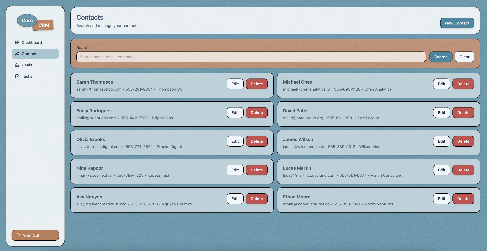
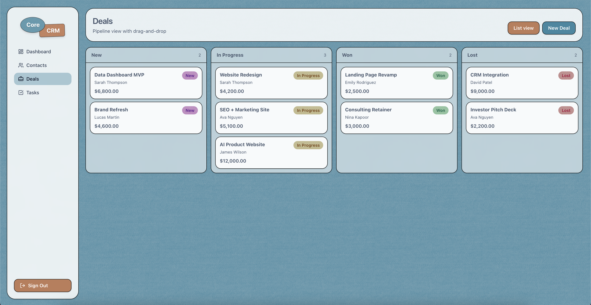
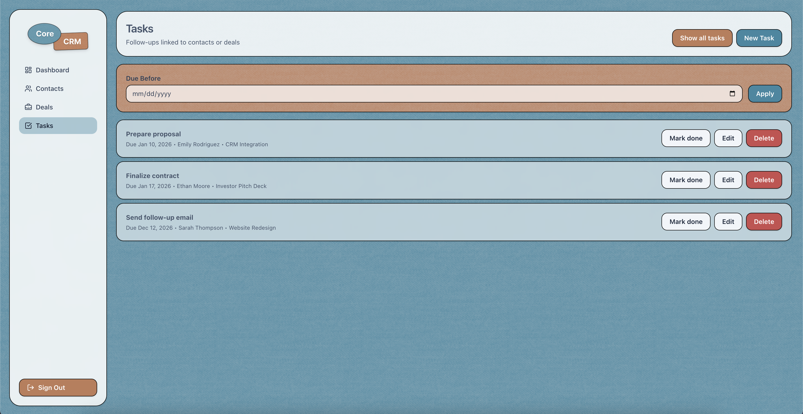
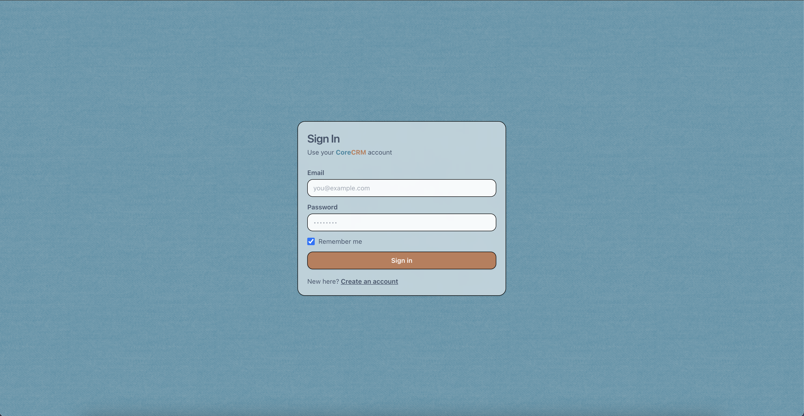

# CoreCRM

## 1. Project Overview

CoreCRM is a full-stack, single-instance CRM web application for individuals or small teams who want a lightweight way to track contacts, deals, and follow-up tasks. It provides an authenticated dashboard and CRUD workflows for core CRM objects, with a Postgres-backed API and a React UI.

The project is designed to run locally via Docker Compose and to deploy cost-effectively to a single AWS EC2 instance using a reverse-proxy Nginx container in front of a Node/Express API. The frontend and backend are deliberately wired to be same-origin in production (through `/api` proxying) to simplify cookie-based auth and avoid CORS complexity.

Key technical capabilities (verified in code):

- Cookie-based authentication using JWT stored in an HTTP-only cookie (backend issues/clears `token`).
- Role-aware authorization for sensitive operations (e.g., admin-only user deletion, admin-only role changes).
- Input validation at the API boundary using Zod schemas with human-readable validation error messages.
- Data access via Drizzle ORM on PostgreSQL (Neon serverless driver), plus migrations managed by drizzle-kit.
- Production-ready container topology: multi-stage frontend build, Nginx static hosting + `/api` reverse proxy.
- Security middleware baseline: Helmet headers, structured logging (Winston), request logging (Morgan), and Arcjet threat protections (Shield enforced; bot/rate-limit enforcement is present but currently disabled in code).

## 2. Screenshots / UI

Dashboard



Contacts



Deals



Tasks



Auth



## 3. High-Level Architecture

### Request lifecycle (browser → backend)

Production is designed around a single origin:

1. The browser loads the built React app (static files) from Nginx.
2. The UI makes API requests to the same origin under the `/api` path.
3. Nginx reverse-proxies `/api` requests to the backend container on port 3000.
4. The backend reads the HTTP-only `token` cookie, validates the JWT, and authorizes requests.
5. The backend queries PostgreSQL (Neon) via Drizzle ORM and returns JSON.

This avoids CORS issues because:

- The browser always calls the same origin (e.g., `https://your-domain/...` and `https://your-domain/api/...`).
- The auth cookie is set with `SameSite=strict` (see [backend/src/utils/cookies.js](backend/src/utils/cookies.js)), which is compatible with same-origin requests and provides strong CSRF resistance.

In development, there are two supported patterns:

- Same-origin API via Vite dev proxy: Vite proxies `/api` to the backend (see [frontend/vite.config.js](frontend/vite.config.js)).
- Direct browser → backend calls (cross-origin): if `VITE_API_URL` points to `http://localhost:3000`, the browser calls the API directly and the backend enables CORS for configured origins (see [backend/src/app.js](backend/src/app.js)).

### Reverse proxy + static serving (Nginx)

The production Nginx config (used inside the frontend image) does the following (see [frontend/nginx/default.conf](frontend/nginx/default.conf) and [nginx/default.conf](nginx/default.conf)):

- Serves built assets from `/usr/share/nginx/html`.
- Proxies all `/api` traffic to `http://backend:3000`.
- Enables gzip for common text-based MIME types.
- Adds long-lived caching headers for hashed static assets.
- Uses SPA fallback (`try_files ... /index.html`) with `no-cache` on `index.html`.

### ASCII architecture diagram

```
+--------------------+               +-----------------------------+
|      Browser       |               |        AWS EC2 (1x)          |
|  React SPA (UI)    |  HTTP/HTTPS   |                             |
|  /, /dashboard...  +-------------->|  Nginx (port 80/443)         |
+--------------------+               |   - serves / (static)        |
          ^                          |   - proxies /api -> backend  |
          |                          +---------------+-------------+
          |                                          |
          |                                   Docker network
          |                                          |
          |                          +---------------v-------------+
          |                          |  Node.js + Express API       |
          |                          |  (backend, port 3000)        |
          |                          +---------------+-------------+
          |                                          |
          |                              Drizzle ORM + Neon driver
          |                                          |
          |                          +---------------v-------------+
          |                          | PostgreSQL (Neon / Neon Local)|
          |                          +-----------------------------+
```

## 4. Technology Stack

### Frontend

- Framework/runtime: React (see [frontend/package.json](frontend/package.json)).
- Build tooling: Vite (dev server + production build) (see [frontend/vite.config.js](frontend/vite.config.js)).
- Routing: React Router (`/login`, `/sign-up`, authenticated app shell under `/`) (see [frontend/src/routes/index.jsx](frontend/src/routes/index.jsx)).
- UI approach: Tailwind CSS v4 + project-specific CSS utility classes and CSS variables (see [frontend/src/index.css](frontend/src/index.css)).
- HTTP client: Axios with `withCredentials: true` so the browser includes the auth cookie on API calls (see [frontend/src/services/apiClient.js](frontend/src/services/apiClient.js)).
- Static assets: served via Vite in dev and baked into `dist/` for production; includes a textured background and logo assets (see [frontend/src/assets](frontend/src/assets)).

### Backend

- Runtime: Node.js (Docker uses `node:18-slim`), ES Modules (`"type": "module"`).
- Framework: Express (see [backend/src/app.js](backend/src/app.js)).
- Routing structure:
  - Route registration under `/api/*` in [backend/src/app.js](backend/src/app.js).
  - Route handlers in [backend/src/routes](backend/src/routes).
  - Controllers in [backend/src/controllers](backend/src/controllers).
  - Services (DB access + domain logic) in [backend/src/services](backend/src/services).
  - Zod validations in [backend/src/validations](backend/src/validations).

### Security

Authentication strategy

- The backend issues a JWT at sign-up / sign-in and stores it in an HTTP-only cookie named `token` (see [backend/src/controllers/auth.controller.js](backend/src/controllers/auth.controller.js) and [backend/src/utils/cookies.js](backend/src/utils/cookies.js)).
- JWT signing/verification uses `jsonwebtoken` with a 1-day expiration (`expiresIn: '1d'`) (see [backend/src/utils/jwt.js](backend/src/utils/jwt.js)).
- The cookie defaults to:
  - `httpOnly: true`
  - `sameSite: 'strict'`
  - `secure: true` in production unless overridden by `COOKIE_SECURE=false`
  - `maxAge: 15 minutes`
    (see [backend/src/utils/cookies.js](backend/src/utils/cookies.js))

Token handling and protection

- Because the JWT is stored in an HTTP-only cookie, it is not accessible from JavaScript (reduces XSS blast radius).
- SameSite Strict prevents cross-site cookie sending, reducing CSRF risk in production’s same-origin deployment model.

Middleware protections

- Helmet is enabled globally (see [backend/src/app.js](backend/src/app.js)).
- Cookie parsing via `cookie-parser` is enabled globally (required for cookie auth).
- CORS is enabled only when `NODE_ENV !== 'production'` (see [backend/src/app.js](backend/src/app.js)).

### Rate Limiting / Abuse Protection

- Arcjet is configured with Shield + bot detection + a global sliding window limiter (see [backend/src/config/arcjet.js](backend/src/config/arcjet.js)).
- A second middleware layer attempts role-based sliding window limits (admin/user/guest) by calling `protect(req)` (see [backend/src/middleware/security.middleware.js](backend/src/middleware/security.middleware.js)).
- Important nuance (verified): enforcement for bot and rate-limit denials is currently commented out in [backend/src/middleware/security.middleware.js](backend/src/middleware/security.middleware.js); only Shield denials return a 403. Also, this middleware runs before route-level auth, so `req.user` is typically unset and role resolves to `guest`.

### Data Layer

- Database: PostgreSQL.
- Primary target: Neon (serverless Postgres) via `@neondatabase/serverless`.
- Query layer: Drizzle ORM (see [backend/src/config/database.js](backend/src/config/database.js)).
- Schema definition: Drizzle `pgTable` definitions in [backend/src/models](backend/src/models).
- Migration strategy:
  - Migrations are generated and applied with drizzle-kit (`npm run db:generate`, `npm run db:migrate`).
  - Migration SQL is stored under [backend/drizzle](backend/drizzle).

### Observability

- Structured logging: Winston.
  - Production logs are JSON with timestamps and stacks.
  - Development logs are colorized with timestamps.
  - Optional file logging via `LOG_TO_FILE=true` (writes `logs/error.log` if writable).
    (see [backend/src/config/logger.js](backend/src/config/logger.js))
- HTTP access logging: Morgan `combined` format routed into Winston (`logger.info`) (see [backend/src/app.js](backend/src/app.js)).

Error handling patterns

- Controllers consistently validate inputs and return 400 with readable Zod error messages.
- Many controllers call `next(e)` on unexpected errors.
- There is no custom Express error handler registered (no `app.use((err, req, res, next) => ...)`), so unhandled errors fall back to Express’s default behavior.

### Testing

- Test runner: Jest (Node environment) (see [backend/jest.config.mjs](backend/jest.config.mjs)).
- HTTP integration testing: Supertest (see [backend/tests/app.test.js](backend/tests/app.test.js)).

### DevOps

- Docker: multi-stage frontend build and separate backend production/development targets.
- Docker Compose:
  - Dev stack includes Neon Local + backend + frontend Vite.
  - Prod stack includes backend + nginx (frontend static + reverse proxy).
    (see [docker-compose.dev.yml](docker-compose.dev.yml), [docker-compose.prod.yml](docker-compose.prod.yml))
- Nginx: static SPA hosting + `/api` reverse proxy (see [nginx/default.conf](nginx/default.conf)).
- AWS EC2: single-instance deployment supported via Compose; optional prebuilt-image compose exists under [deploy/ec2/docker-compose.yml](deploy/ec2/docker-compose.yml).

## 5. Key Features (Verified From Code)

### Authentication: sign-up / sign-in / sign-out

What it does

- Creates accounts, authenticates users, and stores the session as a JWT in an HTTP-only cookie.

Why it matters

- Cookie-based auth works naturally with same-origin reverse proxying and prevents exposing tokens to frontend JavaScript.

Where it is implemented

- Routes: [backend/src/routes/auth.routes.js](backend/src/routes/auth.routes.js)
- Controller: [backend/src/controllers/auth.controller.js](backend/src/controllers/auth.controller.js)
- Password hashing: [backend/src/services/auth.service.js](backend/src/services/auth.service.js)
- JWT signing/verification: [backend/src/utils/jwt.js](backend/src/utils/jwt.js)
- Cookie settings: [backend/src/utils/cookies.js](backend/src/utils/cookies.js)

### Authorization / RBAC

What it does

- Protects API endpoints by requiring a valid cookie token and, for certain operations, requiring the user to have the `admin` role.

Why it matters

- Ensures users can’t modify data they don’t own, and reserves destructive admin actions.

Where it is implemented

- Token auth middleware: [backend/src/middleware/auth.middleware.js](backend/src/middleware/auth.middleware.js)
- Role gates: `requireRole([...])` in [backend/src/middleware/auth.middleware.js](backend/src/middleware/auth.middleware.js)
- User update/delete authorization logic: [backend/src/controllers/users.controller.js](backend/src/controllers/users.controller.js)

### Contacts management + contact notes

What it does

- CRUD contacts for the authenticated user.
- Create and list notes for a contact.
- Contacts search by `q` across name/email/company.

Why it matters

- Provides the core “relationship tracking” portion of a CRM.

Where it is implemented

- API routes: [backend/src/routes/contacts.routes.js](backend/src/routes/contacts.routes.js)
- Controller: [backend/src/controllers/contacts.controller.js](backend/src/controllers/contacts.controller.js)
- Service (ownership enforced in queries): [backend/src/services/contacts.service.js](backend/src/services/contacts.service.js)
- Validation: [backend/src/validations/contacts.validation.js](backend/src/validations/contacts.validation.js)
- UI pages: [frontend/src/features/contacts/pages/ContactsPage.jsx](frontend/src/features/contacts/pages/ContactsPage.jsx), [frontend/src/features/contacts/pages/ContactDetailPage.jsx](frontend/src/features/contacts/pages/ContactDetailPage.jsx)

### Deals pipeline (kanban + drag-and-drop stage updates)

What it does

- Tracks deals linked to a contact and allows moving deals across pipeline stages: `new`, `in_progress`, `won`, `lost`.
- UI supports kanban drag-and-drop and list view.

Why it matters

- Represents CRM pipeline health and progress, enabling quick operational updates.

Where it is implemented

- API routes: [backend/src/routes/deals.routes.js](backend/src/routes/deals.routes.js)
- Controller/service: [backend/src/controllers/deals.controller.js](backend/src/controllers/deals.controller.js), [backend/src/services/deals.service.js](backend/src/services/deals.service.js)
- Validation: [backend/src/validations/deals.validation.js](backend/src/validations/deals.validation.js)
- UI page: [frontend/src/features/deals/pages/DealsPage.jsx](frontend/src/features/deals/pages/DealsPage.jsx)

### Tasks (follow-ups linked to contacts or deals)

What it does

- CRUD tasks for the authenticated user.
- Tasks must be linked to at least one of `contactId` or `dealId` (enforced in validation and in the service).
- “My tasks” endpoint lists open tasks and supports a `dueBefore=YYYY-MM-DD` filter.

Why it matters

- Encodes follow-up discipline and prevents orphaned tasks with no CRM context.

Where it is implemented

- API routes: [backend/src/routes/tasks.routes.js](backend/src/routes/tasks.routes.js)
- Controller/service: [backend/src/controllers/tasks.controller.js](backend/src/controllers/tasks.controller.js), [backend/src/services/tasks.service.js](backend/src/services/tasks.service.js)
- Validation: [backend/src/validations/tasks.validation.js](backend/src/validations/tasks.validation.js)
- UI page: [frontend/src/features/tasks/pages/MyTasksPage.jsx](frontend/src/features/tasks/pages/MyTasksPage.jsx)

### Request logging + structured application logs

What it does

- Writes structured logs for request/response and application events.

Why it matters

- Makes production debugging and basic observability workable on a single host without a full telemetry stack.

Where it is implemented

- Winston config: [backend/src/config/logger.js](backend/src/config/logger.js)
- Morgan → Winston bridge: [backend/src/app.js](backend/src/app.js)

## 6. Repository Structure

```
CoreCRM/
  backend/                 # Node/Express API + Drizzle schema/migrations
    src/
      app.js               # Express app wiring (middleware + routes)
      server.js            # HTTP listener
      config/              # database, logger, Arcjet
      controllers/         # request handlers
      services/            # DB access and domain logic
      middleware/          # auth + security middleware
      models/              # Drizzle pgTable definitions
      routes/              # Express routers
      validations/         # Zod schemas
      utils/               # jwt, cookies, formatting
    drizzle/               # SQL migrations and meta
    tests/                 # Jest + Supertest integration tests

  frontend/                # React + Vite SPA
    src/
      routes/              # app routes, auth guard
      features/            # auth, contacts, deals, tasks, dashboard
      services/            # axios client
      components/          # layout + UI components
      assets/              # logo + texture assets
    nginx/                 # Nginx config used by the production frontend image

  nginx/                   # Root nginx config (mirrors frontend/nginx)
  images/                  # UI screenshots embedded above

  docker-compose.dev.yml   # Full-stack dev (Neon Local + backend + Vite)
  docker-compose.prod.yml  # Production (Nginx + backend)
  scripts/                 # Compose wrappers (up/down/clean)
  deploy/ec2/              # EC2 compose for prebuilt images

  .env.example             # Template for required environment variables
  .env.development         # Dev env file (used by scripts)
  .env.production          # Prod env file (used by scripts)
```

## 7. Local Development

### Prerequisites

- Docker Desktop (Compose v2)

### Environment variables

The repository includes these env files:

- [./.env.example](.env.example): template
- [./.env.development](.env.development): used by the dev Docker script
- [./.env.production](.env.production): used by the prod Docker script

Backend variables (used by the API container)

- `DATABASE_URL` (required)
- `JWT_SECRET` (required)
- `ARCJET_KEY` (optional, but Arcjet is configured)
- `LOG_LEVEL` (optional)
- `COOKIE_SECURE` (optional override; see Security Notes)
- Dev-only: `CORS_ORIGIN` (optional; default `http://localhost:5173`)
- Neon Local dev: `NEON_API_KEY`, `NEON_PROJECT_ID`, `NEON_FETCH_ENDPOINT`, `NEON_LOCAL=true`

Frontend variables

- `VITE_API_URL` (optional): controls axios base URL normalization.
  - If omitted: frontend calls `/api` (intended for same-origin via proxy).
  - If set to `http://localhost:3000`: frontend calls backend directly and expects dev CORS.

### Run the full stack (recommended)

Development stack (Neon Local + backend + frontend Vite):

```bash
npm run dev:docker
```

- Frontend: http://localhost:5173
- Backend: http://localhost:3000
- Neon Local Postgres: localhost:5432

Stop dev stack:

```bash
npm run dev:docker:down
```

### Run database migrations

With the dev stack running:

```bash
docker compose -p corecrm-dev --env-file .env.development -f docker-compose.dev.yml exec backend npm run db:migrate
```

## 8. Docker (Development and Production)

### Development Docker

Defined in [docker-compose.dev.yml](docker-compose.dev.yml):

- `neon-local`: runs `neondatabase/neon_local` and exposes Postgres on 5432.
- `backend`: built from [backend/Dockerfile](backend/Dockerfile) using the `development` target; mounts source for hot reload.
- `frontend`: built from [frontend/Dockerfile.dev](frontend/Dockerfile.dev); runs Vite dev server with HMR.

Volumes

- Named volumes for `node_modules` are used to keep install time fast while still bind-mounting source.

Ports

- `5173:5173` (Vite)
- `3000:3000` (API)
- `5432:5432` (Neon Local)

### Production Docker

Defined in [docker-compose.prod.yml](docker-compose.prod.yml):

- `backend`: built from [backend/Dockerfile](backend/Dockerfile) using the `production` target, exposing 3000 to the compose network.
- `nginx`: built from [frontend/Dockerfile](frontend/Dockerfile), serves `dist/` and proxies `/api` → backend.

Ports

- `80:80` (Nginx)

### Multi-stage builds

- Frontend production image uses a builder stage (Node 20 Alpine) and an Nginx runtime stage (see [frontend/Dockerfile](frontend/Dockerfile)).
- Backend image uses separate `development` and `production` targets (see [backend/Dockerfile](backend/Dockerfile)). The production target uses Debian slim specifically to avoid Alpine-native build pitfalls with packages like `bcrypt`.

### Troubleshooting

- Port conflicts: ensure 80/3000/5173/5432 are free.
- Cookie auth in dev:
  - If calling backend directly (`VITE_API_URL=http://localhost:3000`), ensure `CORS_ORIGIN` includes the frontend origin and that requests include `withCredentials: true` (already set in [frontend/src/services/apiClient.js](frontend/src/services/apiClient.js)).
  - If using Vite proxy, prefer calling `/api` from the browser and let Vite proxy handle it.
- Health checks:
  - Backend exposes `GET /health` (see [backend/src/app.js](backend/src/app.js)).

## 9. Deployment to AWS EC2 (Single Instance)

This repository supports a cost-efficient single-instance deployment: Nginx + backend as containers on one EC2 host.

### Option A: Build on the EC2 instance (uses repository root compose)

1. Provision EC2

   - Instance type: a small general-purpose instance is sufficient for a demo (exact sizing depends on traffic).
   - Storage: enough to hold Docker images and logs.

2. Security group (inbound)

   - Allow `80/tcp` from the internet.
   - If you terminate TLS on-instance, also allow `443/tcp`.
   - Do not expose `3000`, `5173`, or `5432` publicly.

3. Install Docker + Compose

4. Copy repository to the instance

5. Create `.env.production`

   - Must include at least `DATABASE_URL` and `JWT_SECRET`.

6. Start production containers

```bash
npm run prod:docker
```

7. Verify

- App: `http://<EC2_PUBLIC_IP>/`
- API (through proxy): `http://<EC2_PUBLIC_IP>/api`

8. Run migrations (one-time or on deploy)

```bash
docker compose -p corecrm-prod --env-file .env.production -f docker-compose.prod.yml exec backend npm run db:migrate
```

### Option B: Run prebuilt images (deploy/ec2)

The file [deploy/ec2/docker-compose.yml](deploy/ec2/docker-compose.yml) is set up to run published images:

- `backend` image: `${DOCKER_USERNAME}/core-crm-backend:${IMAGE_TAG}`
- `frontend` image: `${DOCKER_USERNAME}/core-crm-frontend:${IMAGE_TAG}`

This assumes you have built and pushed images to a registry, and that [deploy/ec2/.env.production](deploy/ec2/.env.production) exists on the instance.

### Production checklist

- Rotate secrets: `JWT_SECRET`, `ARCJET_KEY`, database credentials.
- Ensure cookies are secure:
  - Use HTTPS in production; keep `COOKIE_SECURE=true`.
  - If you must run HTTP temporarily, set `COOKIE_SECURE=false` explicitly and understand the risk.
- Confirm `/api` proxy works end-to-end.
- Run `npm run db:migrate` against the production database.
- Verify `GET /health` returns 200 from the backend container.

## 10. Security Notes

Secrets management

- The backend reads secrets from environment variables (see [backend/src/utils/jwt.js](backend/src/utils/jwt.js) and [backend/src/config/arcjet.js](backend/src/config/arcjet.js)).
- `.env` files exist in the repository root. Treat them as sensitive and rotate any credentials that have been committed.

HTTPS recommendations

- Production cookies default to `secure: true` (see [backend/src/utils/cookies.js](backend/src/utils/cookies.js)). This requires HTTPS for authentication to work correctly in browsers.
- For a single EC2 instance, typical options include:
  - Terminate TLS directly in Nginx (not implemented in this repo).
  - Terminate TLS at a load balancer in front of EC2 (not part of this repo).

Protections against common attacks

- XSS: auth cookie is HTTP-only; UI does not store JWT in localStorage.
- CSRF: `SameSite=strict` on the auth cookie.
- Security headers: Helmet enabled globally.
- Brute force / abuse:
  - Arcjet Shield is enforced.
  - Bot detection and rate-limit denials are configured but currently not enforced in the middleware (commented out).

Authorization caveats (verified)

- The `GET /api/users` route is annotated as “admin only” in a comment, but is only protected by `authenticateToken` and does not require the `admin` role (see [backend/src/routes/users.routes.js](backend/src/routes/users.routes.js)). Any authenticated user can currently fetch all users.

## 11. API Overview

Base URL

- Production (via Nginx): `/api`
- Dev (depending on config): either `/api` (Vite proxy) or `http://localhost:3000/api` (direct)

Health

- `GET /health` (no auth)
  - Response: `{ status: "OK", timestamp, uptime }`

Auth

- `POST /api/auth/sign-up` (no auth)
- `POST /api/auth/sign-in` (no auth)
- `POST /api/auth/sign-out` (no auth required by route; clears cookie)

Users

- `GET /api/users` (auth required; not role-gated in code)
- `GET /api/users/:id` (auth required)
- `PUT /api/users/:id` (auth required; controller restricts updates to self unless admin, and only admin can change roles)
- `DELETE /api/users/:id` (auth required; admin only; controller also prevents admin self-delete)

Contacts

- `GET /api/contacts` (auth required)
  - Query params: `q` (optional), `ownerId` (optional; only honored for admin users)
- `POST /api/contacts` (auth required)
- `GET /api/contacts/:id` (auth required)
- `PUT /api/contacts/:id` (auth required)
- `DELETE /api/contacts/:id` (auth required)
- `GET /api/contacts/:id/notes` (auth required)
- `POST /api/contacts/:id/notes` (auth required)

Deals

- `GET /api/deals` (auth required)
- `POST /api/deals` (auth required)
- `GET /api/deals/:id` (auth required)
- `PUT /api/deals/:id` (auth required)
- `DELETE /api/deals/:id` (auth required)

Tasks

- `GET /api/tasks` (auth required)
- `POST /api/tasks` (auth required)
- `GET /api/tasks/mine` (auth required)
  - Query params: `dueBefore=YYYY-MM-DD` (optional)
- `GET /api/tasks/:id` (auth required)
- `PUT /api/tasks/:id` (auth required)
- `DELETE /api/tasks/:id` (auth required)

### Sample requests (derived from code)

Sign in

```http
POST /api/auth/sign-in
Content-Type: application/json

{
  "email": "<email>",
  "password": "<password>"
}
```

- On success, the backend sets `Set-Cookie: token=...; HttpOnly; SameSite=Strict; ...` and returns:

```json
{
  "message": "User signed in successfully",
  "user": {
    "id": 123,
    "name": "<name>",
    "email": "<email>",
    "role": "user | admin"
  }
}
```

List contacts

```http
GET /api/contacts?q=Acme
```

```json
{
  "message": "Successfully retrieved contacts",
  "contacts": [
    {
      "id": 123,
      "ownerId": 123,
      "name": "<string>",
      "email": "<string | null>",
      "phone": "<string | null>",
      "company": "<string | null>",
      "createdAt": "<timestamp>",
      "updatedAt": "<timestamp>"
    }
  ],
  "count": 1
}
```

## 12. CI/CD (GitHub Actions)

GitHub Actions workflows live under [.github/workflows](.github/workflows).

Workflow: [.github/workflows/lint-and-format.yml](.github/workflows/lint-and-format.yml) — Runs on pushes and PRs for `main`/`staging` to keep backend code quality consistent. It installs backend dependencies and checks linting and formatting; if issues are found, the workflow fails.

Workflow: [.github/workflows/tests.yml](.github/workflows/tests.yml) — Runs on pushes and PRs for `main`/`staging` to execute the backend Jest test suite. It uses a test database connection string from GitHub Secrets and uploads the backend coverage directory as a downloadable artifact for visibility.

Workflow: [.github/workflows/docker-build-and-push.yml](.github/workflows/docker-build-and-push.yml) — Runs on `main` (or manually) to build and release Docker images, then deploy them to an EC2 host. It builds the backend and frontend image. After that, it pushes both images to Docker Hub as `latest`. Then it SSHs into the EC2 instance, logs into Docker Hub, pulls the latest images, and restarts the containers with `docker compose up -d`.
